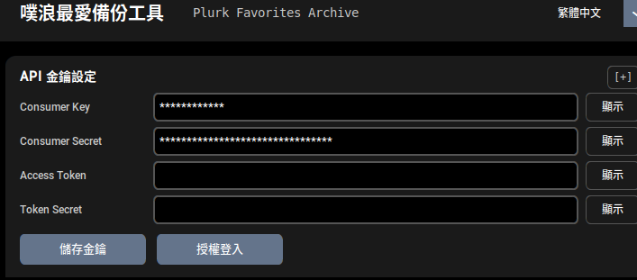
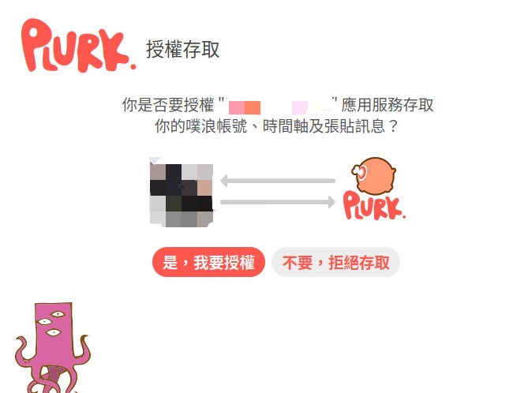
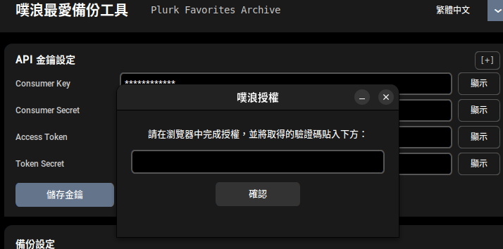

# 噗浪我的最愛備份工具 CT — 使用說明

自動從噗浪帳戶下載、備份及整理你喜歡的噗文，支援進階標籤分類和本地網頁瀏覽。

---

## 目錄

- [這個工具做什麼](#這個工具做什麼)
- [系統需求](#系統需求)
- [安裝方式](#安裝方式)
- [使用方式](#使用方式)
- [授權條款](#授權條款)

---

## 這個工具做什麼

在噗浪上按讚的噗文數量日積月累，
但噗浪官方沒有提供簡便的方式下載整理這些最愛。本工具可以幫助你：

- **自動備份** — 透過 OAuth 登入連接你的噗浪帳戶，只需按一下按鈕即可下載所有喜歡的噗文
- **如何更新** — 支援三種備份模式：
  - **更新現有備份** — 只下載最新的最愛噗文，之前已下載的最愛會自動略過（推薦經常使用）
  - **日期備份** — 從指定日期起備份所有噗文
  - **完整備份** — 重新備份所有最愛噗文
- **資料儲存機制** — 備份資料儲存於電腦的 SQLite 資料庫，隨時可瀏覽
- **進階標籤** — 為喜歡的噗文加上自訂標籤，輕鬆分類整理
- **網頁瀏覽** — 透過內建網頁介面瀏覽、搜尋和篩選你的最愛噗文
- **即時統計** — 監控備份進度，查看已備份的噗文總數和更新情況

---

## 系統需求

只需要你的作業系統，**不需要安裝 Python**。

| 平台 | 支援狀況 |
|---|---|
| Windows | ✅ |
| macOS | ✅ |
| Linux（Ubuntu / Debian 及其他） | ✅ |

---

## 安裝方式

### 1. 下載執行檔

前往 [GitHub Releases 頁面](https://github.com/rkwithb/Plurk-Get-Favorites-Tool-CT/releases)，依個人平台下載對應檔案：

| 平台 | 檔案名稱 |
|---|---|
| Windows | `plurk-favorites-win.exe` |
| macOS | `plurk-favorites-macos` |
| Linux | `plurk-favorites-linux` |

### 2. 各平台設定

**Windows**

直接雙擊 `.exe` 檔案即可啟動。若 Windows SmartScreen 顯示警告訊息，請點選「**更多資訊 → 仍要執行**」。

**macOS**

由於執行檔未經 Apple 開發者憑證簽署，macOS Gatekeeper 在第一次執行時會封鎖它。

解除方式（只需執行一次）：
1. 在檔案上按右鍵（或 Control + 點按），選擇「**打開**」。
2. 在出現的對話框中點選「**打開**」。

或者，前往「**系統設定 → 隱私權與安全性**」，在遭封鎖的應用程式旁點選「**仍要打開**」。

**Linux**

執行前需先賦予執行權限：

```bash
chmod +x plurk-favorites-linux
./plurk-favorites-linux
```

---

## 使用方式

### 啟動工具之前 — 申請 API 金鑰

使用本工具需要先從噗浪申請 **Consumer Key** 和 **Consumer Secret**。

**前置需求：**
- 擁有一個噗浪帳號
- 已登入噗浪

請參考以下教學完成申請：

👉 **[完整的 API 金鑰申請教學](https://github.com/rkwithb/Plurk-Get-Favorites-Tool/blob/main/Tutorial/plurkappkey.md)** — 包含詳細步驟、表單填寫說明與安全提醒

取得 Consumer Key 和 Consumer Secret 後，回到本工具繼續下一步。

### 第一次啟動 — 設定 OAuth 認證

1. 啟動工具。應用程式會顯示「**API 金鑰設定**」對話框。



2. 將前面步驟申請到的兩項資訊填入工具欄位。
   - **Consumer Key** — 填入對應欄位
   - **Consumer Secret** — 填入對應欄位

3. 點選「**儲存金鑰**」按鈕。
4. 點選「**授權登入**」，瀏覽器會自動開啟噗浪授權頁面。
5. 使用你的噗浪帳號登入（如果還沒登入的話），然後授權本工具存取你的最愛資料。



6. 授權完成後，複製頁面上的驗證碼，回到應用程式輸入驗證碼並點選「**確認**」。



7. 按下「**確認**」以後，應用程式會自動填入 **Access Token** 和 **Token Secret**，按下「**儲存金鑰**」完成設定。

### 選擇備份模式

應用程式會顯示三個備份選項：

- **更新現有備份** — 只下載自上次備份後新增加的最愛噗文。推薦在定期備份時使用。
- **指定日期** — 輸入你想開始的年份月份（例如 `202501`），下載該月之後的所有最愛噗文。
- **完整備份** — 重新下載並備份所有最愛噗文。首次備份或想全部重新整理時使用。

### 開始備份

1. 選擇你的**備份模式**（見上方說明）。
2. 如果選擇「**指定日期**」模式，輸入起始日期（格式如 `202501`）。
3. 點選「**▶  開始備份**」按鈕。
4. 應用程式會連接噗浪 API 下載你的最愛噗文，進度條會實時顯示進度。
5. 在日誌中可看到統計資訊：
   - **已儲存總數** — 至今備份的所有噗文
   - **本次新增** — 這次備份新增的噗文數
   - **資料庫大小** — 當前資料庫體積
6. 備份完成後，應用程式會顯示本次備份的統計結果。

### 瀏覽和標籤管理

備份完成後，可以使用兩個瀏覽模式：

- **「一般瀏覽」** — 點選此按鈕，使用網頁介面查閱你的最愛噗文。支援按日期或關鍵字搜尋。
- **「進階瀏覽（可操作 Tag）」** — 進階模式提供完整的 Tag（標籤）管理功能。只有這個模式才能為噗文加上自訂標籤，便於日後分類查詢。
- **「更新Tag資料」** — 當你在進階瀏覽模式中新增或刪除標籤時，使用此按鈕重新從資料庫匯出含有新標籤的噗文資料（月份 JS 檔案）。

### 重複執行

你可以安心地定期執行**更新現有備份**，只會下載新的最愛噗文。備份資料存在電腦端，不會被覆蓋。

### 資料儲存位置

所有備份資料預設儲存在：
- **Windows** — 工具資料夾內的 `backup_js` 資料夾
- **macOS / Linux** — 工具資料夾內的 `backup_js` 資料夾

你可以點選「**開啟備份資料夾**」按鈕快速存取備份位置。也可在應用程式設定中自訂備份資料夾位置。

---

## 常見問題

### 應用程式要求我重新授權，但我沒有進行任何設定變更
這通常是因為授權（Access Token）已過期（通常在一段時間後）。直接再按工具畫面的「**授權登入**」按鈕，完成一次新的 OAuth 授權即可。

### 備份過程中應用程式卡住了
這可能是因為噗浪 API 暫時無法回應或網路連線中斷。稍候片刻後重新嘗試備份。應用程式會自動恢復從上次中斷處繼續下載。

### 我可以在多台電腦上使用這項工具嗎？
可以。每台電腦上的備份資料是獨立的。如果想在多台電腦間同步備份資料，你可以手動複製備份資料夾中的資料庫檔案，或使用雲端同步工具（如 OneDrive、Google Drive 等）。

### 標籤或備份資料會上傳到雲端嗎？
不會。所有資料儲存在你的電腦端，不會上傳到任何伺服器或雲端服務。

---

## 授權條款

本專案採用 [Apache License 2.0](https://www.apache.org/licenses/LICENSE-2.0) 授權，**僅限非商業使用**。

- ✅ 個人使用、學習、研究
- ✅ 非營利組織使用
- ❌ 商業用途（包括販售、商業服務等）
- ❌ 未經授權的修改或發行

> **免責聲明**：使用風險自負。作者不對任何損失或損害負責。使用本工具備份噗文時請遵守噗浪的服務條款和相關法律規定。
